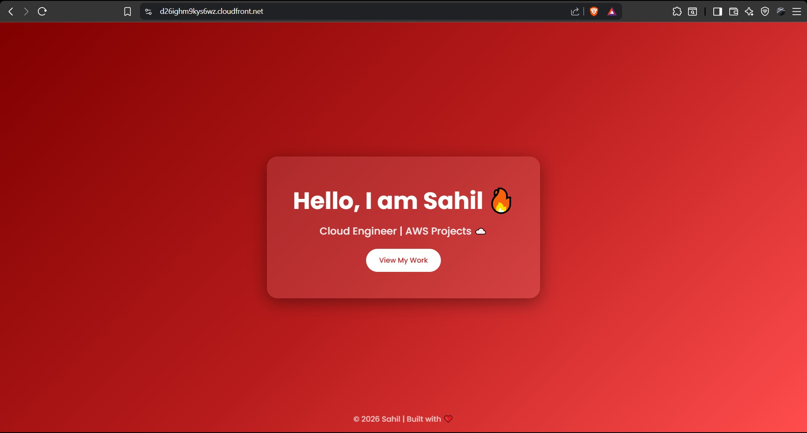
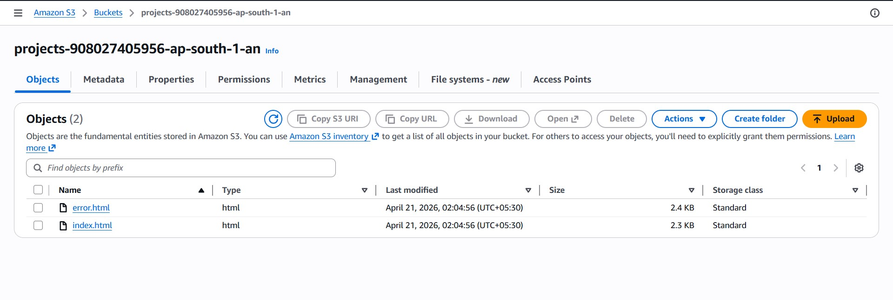
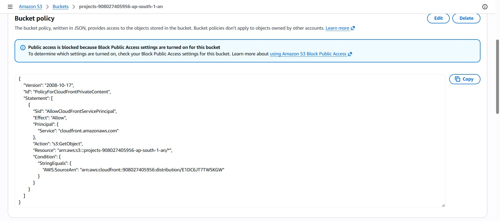
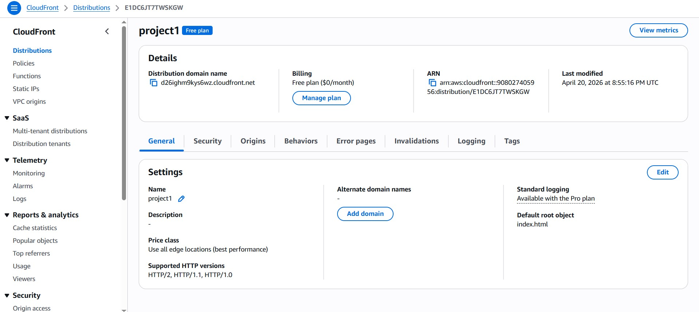
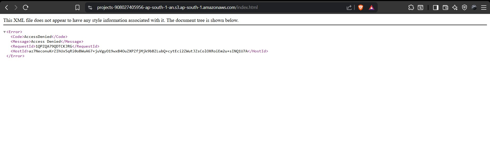
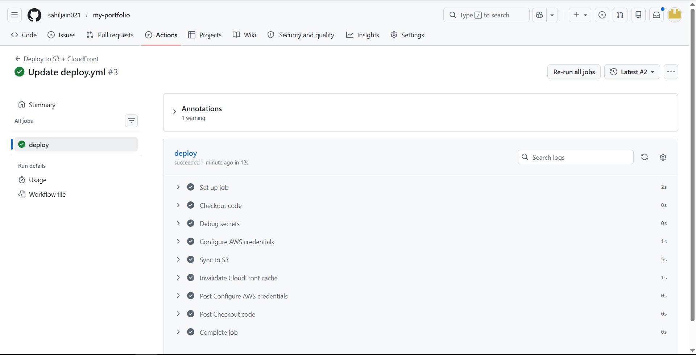

# 🌐 AWS Static Website Hosting (S3 + CloudFront + CI/CD)

## 🚀 Overview

This project demonstrates hosting a static website on AWS S3 with CloudFront CDN, secured using Origin Access Control (OAC), and automated deployment using GitHub Actions.

## 🧱 Architecture

User → CloudFront → S3 (private bucket)

## 🔐 Security

* S3 bucket is private
* Access only through CloudFront (OAC)
* HTTPS enabled

## ⚙️ CI/CD Pipeline

* Code pushed to GitHub
* GitHub Actions deploys to S3
* CloudFront cache invalidated automatically

## 🌍 Live Demo

https://d26ighm9kys6wz.cloudfront.net/

## 📸 Proof (Screenshots)

### Website Running

### S3 Bucket (Private)

### CloudFront Distribution

### Access Denied (Direct S3 Access)

### GitHub Actions CI/CD

## 💼 Key Skills Demonstrated

* AWS S3
* CloudFront CDN
* OAC Security
* HTTPS Configuration
* CI/CD with GitHub Actions
* DevOps Workflow
